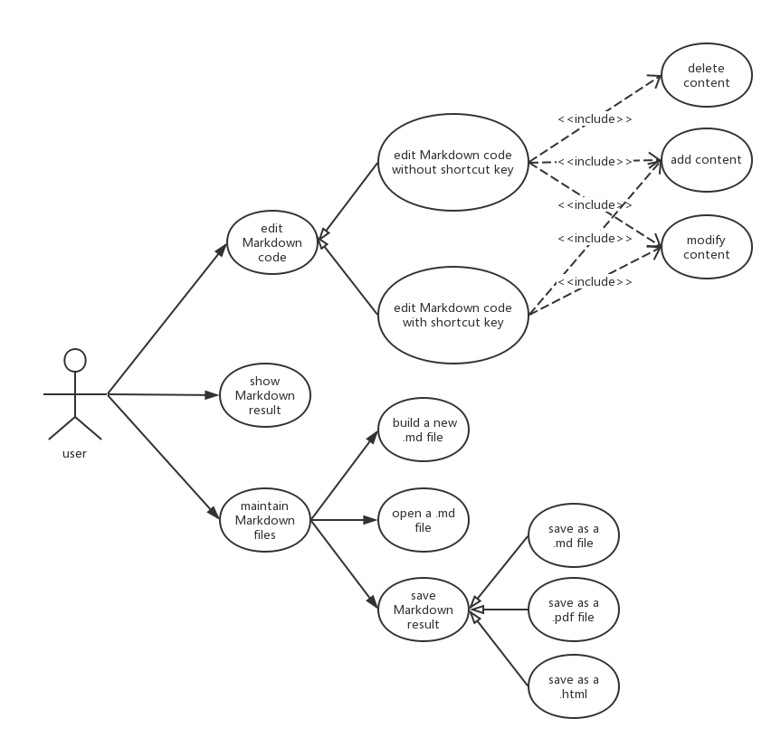
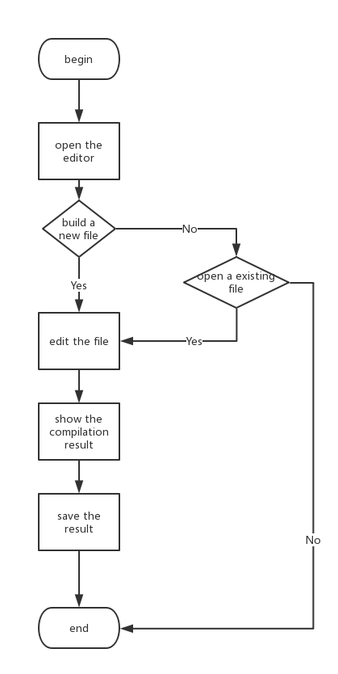

# 1.Introduction #  
### &emsp;1.1&ensp;Purpose ###  
&emsp;&emsp;Create a web-based Markdown editor based on browser and html5. The user can use a simple markup syntax to make
the original plain text content have a certain format. For bloggers, wikis, etc., the grammar is simple and easy
to learn. It greatly facilitates the layout of documents, papers and other texts, and enriches the display effect.  
# 2.Project Introduction #  
### &emsp;2.1&ensp;Purpose of Project ###  
&emsp;&emsp;**Service target**: The project is dedicated to creating a real-time display of the markdown editor, providing users with a 
simple and convenient writing and editing environment. The content input by the user is interactively displayed in real time, 
which is convenient for the user to edit. You can read the already written txt file for editing, or you can publish the edited 
text to html or pdf format. At the same time, it provides a simple and friendly interface to bring a good user experience.  
&emsp;&emsp;**Features target**: The project is dedicated to the user's purpose of editing, reading and publishing markdown text. 
The main functions are editing, display, and reading/storing functions.  
### &emsp;2.2&ensp;Project applicable user ###  
&emsp;&emsp;The project is suitable for a wide range of bloggers and wiki authors, and users can easily modify and update them. 
For scholars who are active in universities and enterprises, markdown can not only save the trouble of typesetting, but also 
make the papers and results more complete.  
### &emsp;2.3&ensp;Feasibility Analysis ###
&emsp;&emsp;Technically, the project's development software conditions are browsers and html5, which are now very common and easy 
to implement. The logo text language itself has no difficult syntax. The function of the editor is to convert the written markdown 
text into html language and display it on the browser.  
&emsp;&emsp;The project is extremely versatile. As a tool, markdown is mainly used to improve efficiency and writing experience. 
It is suitable for people who often work in code words, text typesetting, etc., for example: bloggers, website editors, publishers, 
novelists, document programmers, etc.  
&emsp;&emsp;In terms of project profitability, advertisements can be added in the sidebar of the web page and other blank spaces. 
The specific situation is determined by the circumstances. The project is mainly convenient for the majority of users, not profitable.  
&emsp;&emsp;Combining the above three aspects, the conclusion that the project is feasible.  
# 3.Module function and use case #  
### &emsp;3.1&ensp;editing module ###  
#### &emsp;&emsp;3.1.1&ensp;***Edit a Markdown code without shortcut key*** ####  
|Use case|User wants to edit a Markdown code in the document that has been opened|
|:----:|:----:|
|version|1|
|created(date)|2018.09.06|
|Author|Yuxuan Liu|
|Goals|Editing Markdown code to get a .pdf/.md/.hml file.|
|Summary|User edits Markdown code in a read-write box which displays the latest version of the code.|
|Actors|User|
|Trigger|When user clicks in the editing box, he can start to change the content in the box.|
|Precondition|There exists a read and write document and it has been opened.|
|Frequency|Anytime user wants to edit the Markdown code.|
|Postcondition|The Markdown code has been changed and compilation result can been seen in another box.|  

|Basic Flow|Actor|System|
|:----:|:----:|:----:|
||Clicks in the editing box||
|||A cursor appears on the position where user click in the box. |
||Edit the content in the box.||
|||Both content in editing box and compilation result change accordingly and simultaneously.|  
#### &emsp;&emsp;3.1.2&ensp;***Edit a Markdown code with shortcut key*** ####  
|Use case|User wants to use shortcut key to edit a Markdown code in the document that has been opened|
|:----:|:----:|
|version|1|
|created(date)|2018.09.06|
|Author|Yuxuan Liu|
|Goals|Editing Markdown code to get a .pdf/.md/.hml file.|
|Summary|User uses shortcut key to edit Markdown code in a read-write box which displays the latest version of the code.|
|Actors|User|
|Trigger|When user clicks in the editing box, he can start to change the content in the box.|
|Precondition|There exists a read and write document and it has been opened.|
|Frequency|Anytime user wants to edit the Markdown code.|
|Postcondition|The Markdown code has been changed and compilation result can been seen in another box.|  

|Basic Flow|Actor|System|
|:----:|:----:|:----:|
|1|Clicks in the editing box||
|2||A cursor appears on the position where user click in the box. |
|3|Uses correct shortcut key combination to edit the content in the box.||
|4||Both content in editing box and compilation result change accordingly and simultaneously.|  

|Alternative Flow|Actor|System|
|:----:|:----:|:----:|
|1|Uses undefined shortcut key combination to edit the content in the box.||
|2||Content in the box will not change|  
### &emsp;3.2&ensp;display module ###  
#### &emsp;&emsp;3.2.1&ensp;***Display the Markdown result*** ####  
|Use case|Display the Markdown result|
|:----:|:----:|
|version|1|
|created(date)|2018.09.06|
|Author|Yifan Zang|
|Goals|To show the compilation result of the Markdown code in the display window.|
|Summary|Display the result of the Markdown code in the display window in real time when users are coding in the input window.|
|Actors|User|
|Trigger|User types in the input window. (Real time)|
|Precondition|The input window is not blank   OR There are changes in the input window.|
|Frequency|Anytime when user makes changes in the input window. (Real time)|
|Postcondition|A new vision of the compilation result is showed in the display window.|  

|Basic Flow|Actor|System|
|:----:|:----:|:----:|
|1|Empty the input window.||
|2||Show nothing in the display window.|
|3|Make change in the input window.||
|4||Recompile the Markdown code and reshow the new result in the display window.|  

|Alternative Flow|Actor|System|
|:----:|:----:|:----:|
|1|The current input is invalid for Markdown grammar.||
|2||Show the input directly in the display window without compilation.|  
### &emsp;3.3&ensp;file system module ###  
#### &emsp;&emsp;3.3.1&ensp;***Newly build a new file*** ####  
|Use case|Display the Markdown result|
|:----:|:----:|
|version|1|
|created(date)|2018.09.06|
|Author|Yifan Zang|
|Goals|To build a brand new file with a blank input window and a blank display window.|
|Summary|Users sometimes have the need to compile two or more than two files at the same time, so it is needed to prepare a new file to compile.|
|Actors|User|
|Trigger|User clicks the ‘New File’ button.|
|Precondition|User open our website..|
|Frequency|Anytime when user clicks the ‘New File’ button.|
|Postcondition|A brand new file with a blank input window and a blank display window are showed in the website.|  

|Basic Flow|Actor|System|
|:----:|:----:|:----:|
|1|Clicks the ‘New File’ button.||
|2||A brand new file with a blank input window and a blank display window are showed in the website.|  
#### &emsp;&emsp;3.3.2&ensp;***load a Markdown file*** ####  
|Use case|load a Markdown file|
|:----:|:----:|
|version|1|
|created(date)|2018.09.06|
|Author|Bingfeng Han|
|Goals|Opne an existing file.|
|Summary|User clicks “open file” button to open a .md file and edit it.|
|Actors|User|
|Trigger|Click the 'load' button.|
|Precondition|User enters the editor page.|
|Frequency|Anytime user wants to open a .md file.|
|Postcondition|A.md file is opened and in an editable state.|  

|Basic Flow|Actor|System|
|:----:|:----:|:----:|
|1|Click “open file” button||
|2||Pops out a window that display the file list|
|3|Choose one of the files and click “open” button||
|4||The.md file is opened and in a user editable state|
|5|Click "cancel" button||
|6||Unopen the file and return to the edit screen|

|Alternative Flow|Actor|System|
|:----:|:----:|:----:|
|1|When a new file is opened, the current edit document is not saved||
|2||Ask if you open a new .md file without saving it|  
#### &emsp;&emsp;3.3.3&ensp;***save the Markdown file*** ####  
|Use case|save the Markdown file|
|:----:|:----:|
|version|1|
|created(date)|2018.09.06|
|Author|Bingfeng Han|
|Goals|Save a currently edited.md, .pdf or .htm file|
|Summary|User clicks the “save” button to save a.md file to the specified address|
|Actors|User|
|Trigger|User clicks the “save” button|
|Precondition|When user opens or creates a new text on the editor page|
|Frequency|Anytime the user edits a file|
|Postcondition|The.md file is saved locally and the user can continue editing the current.md file|  

|Basic Flow|Actor|System|
|:----:|:----:|:----:|
|1|Click the "save file" button||
|2||The system displays the save address selection window, and the user selects to save the current.md file|
|3|Click "save" button||
|4||The.md file is saved locally and the current text is in a user-editable state|
|5|Click "cancel" button||
|6||The system unsaves the current text and returns to the editable state of the document|

|Alternative Flow|Actor|System|
|:----:|:----:|:----:|
|1|When the current page is closed, the current edit document is not saved||
|2||Asks if the current page is closed without saving|
|3|When the.md file name conflicts with the existing file, ask if it is overwritten||
|4||When the user selects "yes", the overlay is saved; When the user selects cancel, give the user the opportunity to modify the file name|  
# 4.Non-functional requirements #  
### &emsp;4.1&ensp;Operation Environment ###  
&emsp;&emsp;This system should be able to run in Mac and Windows systems.  
&emsp;&emsp;This system is a Markdown editor which supports multi-platform web pages for html5. Most of the user's devices are PC, mobile phone or tablet devices, so our system should be applied to Mac and Windows, which have high popularity and usage. Besides there should be no barriers and functional differences between them, so they can interact across platforms and systems.  
&emsp;&emsp;As Windows system is the most popular among all user groups, and it has fewer obstacles to utilize, so developers are more likely to analyze and test all aspects in this system to improve design and requirements. In this case, we started with Windows in the early stage of design and development of the Markdown editor platform for web page version.   
&emsp;&emsp;After the system is well designed and developed in Windows system, we will start the follow-up work of other platforms.  
### &emsp;4.2&ensp;Performance Requirements ###  
&emsp;&emsp;When using PC-side browser to access the web site, ignoring the impact of local machine performance, each page should be opened in less than 2 seconds.  
&emsp;&emsp;The editor should be real-time, which means the display window should show the latest results within 2 seconds after the user updates the Markdown code in the input window.  
&emsp;&emsp;Read and write files should be completed in 2 seconds, and file saving should be completed in 1 second.  
# 5.Use case chart and flow chart #  
### &emsp;5.1&ensp;use case chart ###  

### &emsp;5.2&ensp;flow chart ###  

